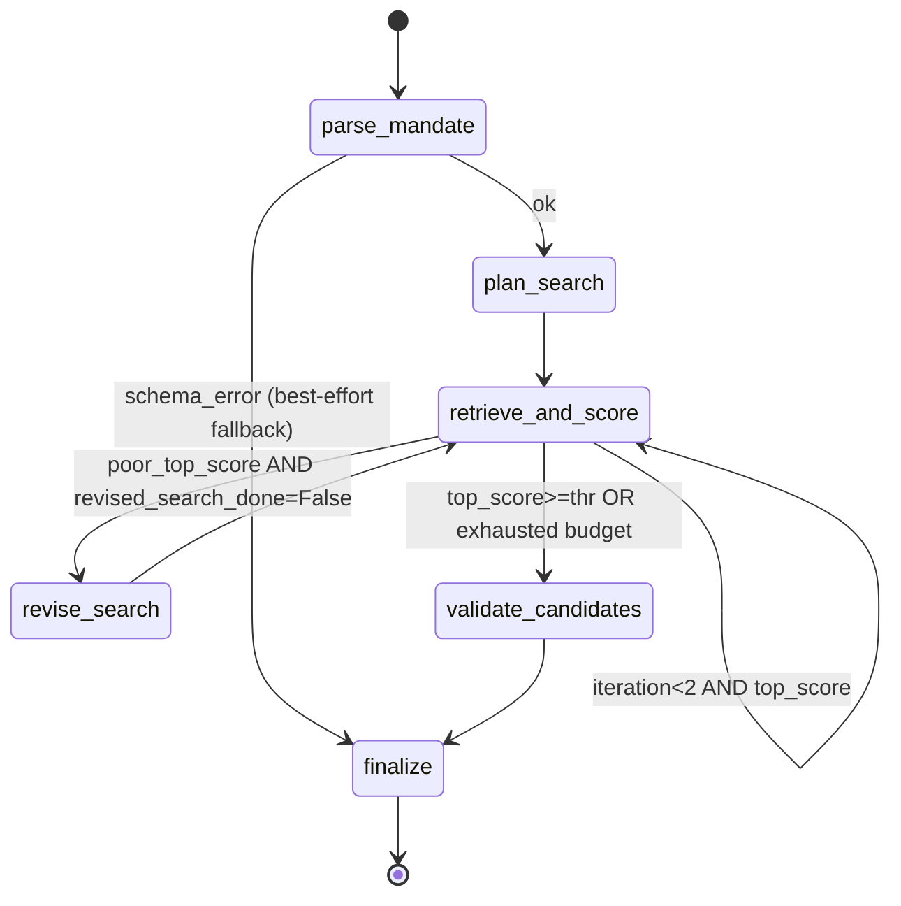

# Comparables.ai — Agentic Search over a 50k Company Catalog

An end-to-end agentic search/reasoning system built against the Comparables.ai
technical assessment brief: natural-language mandate → structured retrieval
(BM25 + structured filters) → evidence-grounded candidate ranking → bounded
failure recovery.

> **Status:** 5/5 deterministic eval queries pass against real Ollama
> (`ministral-3:3b`). See `eval/report.md` for the latest run.

---

## Table of Contents

1. [Architecture overview](#architecture-overview)
2. [Implemented workflow](#implemented-workflow)
3. [Orchestration framework](#orchestration-framework)
4. [Structured state](#structured-state)
5. [Tools](#tools)
6. [Retrieval / filtering strategy](#retrieval--filtering-strategy)
7. [Validation & ranking](#validation--ranking)
8. [Evidence grounding](#evidence-grounding)
9. [Search revision & failure recovery](#search-revision--failure-recovery)
10. [LLM / model choices](#llm--model-choices)
11. [Latency & cost observations](#latency--cost-observations)
12. [Evaluation](#evaluation)
13. [Known limitations](#known-limitations)
14. [Intentionally excluded](#intentionally-excluded)
15. [Quickstart](#quickstart)
16. [Future evolution](#future-evolution)

---

## Architecture overview

The project follows FastAPI **layered best practices**: thin HTTP layer, business
logic in services, data access behind repositories, agent in its own subgraph.

```
┌─────────────────────────── FastAPI app (uvicorn) ───────────────────────────┐
│                                                                              │
│  api/v1/         thin HTTP: routers, deps (Depends), response_model          │
│   │                                                                       │
│   ▼                                                                       │
│  services/        WorkflowService.invoke(query) -> SearchResponse            │
│   │                                                                       │
│   ▼                                                                       │
│  agent/           LangGraph StateGraph                                       │
│   │  parse_mandate ─► plan_search ─► retrieve_and_score                    │
│   │                                          │                              │
│   │                              ┌───────────┤ (revise? only if poor)     │
│   │                              ▼           └──► revise_search ──►        │
│   │                       validate_candidates ─► finalize                   │
│   ▼                                                                       │
│  tools/           @tool-decorated: bm25_search, filter_search, get_company  │
│  repositories/    CompanyRepository (aiosqlite) · BM25Repository (rank_bm25) │
│  llm/             AsyncOpenAI client → Ollama (OpenAI-compat)              │
└──────────────────────────────────────────────────────────────────────────────┘
```

### Production-grade patterns in use

| Pattern | Where | Why |
|---|---|---|
| App factory `create_app()` | `src/comparables/main.py` | Multiple test instances, clean lifespans, no global state |
| Lifespan context manager | same | Startup: load BM25 pickle, open SQLite pool, warm LLM client. Shutdown: close cleanly. |
| Dependency injection (`Depends`) | `src/comparables/api/deps.py` | `get_settings`, `get_db`, `get_llm`, `get_workflow`, `get_run_repo` — every dep is overridable in tests |
| Versioned API (`/api/v1/`) | `src/comparables/api/v1/router.py` | Future-proofs breaking changes |
| Health/readiness split | `endpoints/health.py` | `/live` is unconditional; `/ready` checks BM25 + LLM + SQLite |
| Custom exception handlers | `main.py` + `core/exceptions.py` | Domain exceptions → RFC-7807-style JSON error bodies |
| `RunIdMiddleware` | `main.py` | Per-request `X-Run-Id` header; id propagates via `contextvars` for log correlation |
| Async-first | everywhere | `httpx.AsyncClient`, `aiosqlite`, BM25 search runs in `asyncio.to_thread` (CPU-bound) |
| Response models | every endpoint | OpenAPI consumes the same Pydantic models the service produces |
| `pydantic-settings` | `core/config.py` | Typed `.env`, no stringly-typed config |
| `structlog` (JSON in prod) | `core/logging.py` | Structured logs with `run_id`, `event`, `duration_ms`, ... — pipeable to Loki / Cloud Logging |

---

## Implemented workflow



### Stages (per assessment brief)

| Stage | LLM? | Notes |
|---|---|---|
| `parse_mandate` | yes (1 call) | NL query → `ParsedMandate` (`intent`, `filters`, `must_haves`). Sanitized post-hoc against allowed values. |
| `plan_search` | yes (1 call, optional) | Picks `use_bm25`, `use_filters`, `limit_per_iter`, `keyword_boost`. Skipped when filters/keywords are degenerate. |
| `retrieve_and_score` | no | BM25 keyword search + structured filter search → merged, scored, capped at 100. |
| `revise_search` | yes (1 call, optional) | Loosens filters, broadens keywords. Fires at most once. |
| `validate_candidates` | yes (1 call, batched) | One LLM call covers all top-N candidates; per-candidate `relevant`, `evidence_spans`, `reason`. |
| `finalize` | no | Sorts by score, drops `relevant=False`, caps at 10. |

---

## Orchestration framework

**LangGraph** (`langgraph>=0.2`) was chosen over alternatives because:

- **Stateful, cyclic**: retrieval can fail and trigger a revise loop. A pure DAG
  framework would either need an outer loop or degenerate into a state machine
  anyway.
- **Conditional edges**: the decision of whether to revise is a function of
  state (`iteration`, `revised_search_done`, `top_score`).
- **In-memory checkpointing** is enough for our SLA — no Redis/Postgres needed
  in the 12–16h budget.
- **Pydantic-native**: state can be `TypedDict` of Pydantic models, giving us
  schema validation for free.
- **Pluggable persistent storage** (drop-in `PostgresCheckpointer` later — see
  [Future evolution](#future-evolution)) without rewriting the graph.

Alternatives considered:

- **Raw async/await with a hand-rolled state machine**: would re-implement what
  LangGraph gives. Skipped.
- **Haystack / LlamaIndex pipelines**: built for RAG, not multi-step agent
  loops. Skipped.

---

## Structured state

`AgentState` (`src/comparables/agent/state.py`):

```python
class AgentState(TypedDict, total=False):
    run_id: str
    raw_query: str
    mandate: ParsedMandate | None
    search_plan: SearchPlan | None
    candidates: list[ScoredHit]              # capped at MAX_CANDIDATES_PER_ITER
    iteration: int                           # 0..2
    revised_search_done: bool
    validation: list[ValidatedItem]
    final: list[Candidate]
    parse_ok: bool
    plan_ok: bool
    validation_ok: bool
    parse_error: str | None
    settings_limits: dict[str, int]          # injected at run start
```

All LLM outputs are constrained by Pydantic JSON schemas
(`ParsedMandate`, `SearchPlan`, `BatchVerdicts`). Validation is strict
(`LLMClient.complete_json`) and on schema error the node falls back to a
sensible default rather than letting bad data flow downstream.

---

## Tools

Three deterministic tools (no LLM in the tool itself), each registered through
the `@tool` decorator in `src/comparables/tools/`:

| Tool | Purpose | Inputs | Output |
|---|---|---|---|
| `bm25_search` | Lexical retrieval over `name + description` | `query: str`, `top_k: int` | `[{company_id, score}]` |
| `filter_search` | Deterministic SQL filter (industry, location, revenue, employees, year) | FilterSpec, `top_k` | `[{company_id, score=1.0}]` |
| `get_company` | Hydrate one record for evidence grounding | `company_id: int` | `CompanyRecord` |

Each tool is timed and its result emitted as a `tool_call` event in the run log
with `duration_ms`, `ok`, `error?`.

---

## Retrieval / filtering strategy

Two parallel, complementary paths:

1. **BM25** (`rank_bm25.BM25Okapi`) over the `name + description` corpus.
   - Pre-tokenized at ingestion; saved to `data/bm25.pkl`.
   - Query-time scoring is wrapped in `asyncio.to_thread` (CPU-bound).
   - Normalized to `[0, 1]` per result set.
2. **Structured filters** (SQL on SQLite, async via `aiosqlite`):
   - `industry IN (...)`, `location IN (...)`,
     `revenue_range IN (...)`,
     `employee_count >= ? AND <= ?`,
     `founded_year >= ? AND <= ?`.
   - Indexes on every closed-vocab column at ingestion.

**Score combination** (`SCORE_W_BM25=0.7`, `SCORE_W_FILTERS=0.3`):

```
score = α · bm25_norm + β · filter_match
```

A candidate that matched **only** via BM25 still earns `0.7 * normalized_bm25`;
a candidate that matched **only** via filters earns `0.3`. Both sources have to
collude for a high score — by design.

Why BM25 and not dense embeddings:

- Descriptions are short (≤100 chars), noisy, and templated — vector recall
  buys little here.
- BM25 is deterministic and explainable (you can show the matched terms).
- BM25 builds are O(N · avg_terms) and run once at ingestion (≈3s for 50k).

---

## Validation & ranking

Top-N candidates (≤10 by `MAX_CANDIDATES_TO_VALIDATE`) are validated by a
single LLM call (batched) that returns per-candidate verdicts:

```python
class Verdict(BaseModel):
    company_id: int
    relevant: bool
    evidence_spans: list[str]   # exact substrings
    reason: str
```

Re-ranking = `score` descending, filtering out `relevant=False` (only as a
fallback — if validator rejects all, we still surface the best scores).

---

## Evidence grounding

Every `evidence_span` returned by the validator **must** be a verbatim substring
of `"{name} {description}"` of that record. This is enforced in two places:

1. **Schema prompt** (`VALIDATE_CANDIDATE_SYSTEM`): "If you cannot find a
   verbatim span that supports relevance, set relevant=false and
   evidence_spans=[]."
2. **Code-side post-filter** (`validate_candidates_node`): we drop any span
   that doesn't pass `s in full_text`. `relevant` is forced to `False` if zero
   grounded spans remain.

This guarantees that:

- A user can highlight exactly which phrase of a record justified inclusion.
- The validator cannot "lie" about relevance — if no quoted text supports it,
  we mark the company not relevant.

---

## Search revision & failure recovery

After the first retrieval, if the top candidate's score is below the revise
threshold **and** we haven't already revised, the graph invokes `revise_search`:

- LLM receives the original mandate, the top-5 current results, and the
  iteration number.
- LLM proposes a relaxed `ParsedMandate`: drop or loosen constraints, add
  synonyms to `keywords`.
- The new mandate is sanitized through the same allow-list scrubber.
- We re-enter `retrieve_and_score` once. Bounded to **at most 1 revised search
  per run** by `MAX_REVISED_SEARCHES=1`.

If the budget is exhausted (LLM calls ≥ 5, iterations ≥ 2, or workflow
timeout), `finalize` falls back to ordering by score alone.

---

## LLM / model choices

| Provider | Ollama (open-source, local) |
|---|---|
| API | OpenAI-compatible (`/v1/chat/completions`) via `openai.AsyncOpenAI` |
| Default model | `ministral-3:3b` (≈3 GB, structured-output clean) |
| Fallback models | `qwen3.5:2b` (uses thinking mode, slower), `deepseek-r1:1.5b` (CoT output) |
| Structured output | JSON schema validation; on parse fail, retry once with the same prompt, then fall back |

Why open-source: 0 USD/run, reproducibility, no data leaves the box. Trade-off
is latency (CPU-bound inference). On a modern laptop the eval averages 47s/run
for 3 LLM calls.

Prompt design notes: each prompt cites **allowed values** explicitly
(`PARSE_MANDATE_SYSTEM`) and provides `schema_instructions(Pydantic model)` so
the LLM knows which keys exist and which types are accepted. Even so, smaller
models sometimes hallucinate; the **sanitizer** in
`src/comparables/agent/sanitize.py` strips any `industries`/`locations`/
`revenue_buckets` value not in the dataset's allowed set, with a synonym map
for common paraphrases.

---

## Latency & cost observations

From the latest eval (`eval/report.md`):

| Query | Latency (s) | LLM calls | Iters | Results |
|------|------------:|----------:|------:|--------:|
| q1: AI fintech Nordics >100 emp | 58.1 | 3 | 1 | 10 |
| q2: Renewable energy DE founded>2018 | 49.2 | 3 | 1 | 10 |
| q3: Healthcare $50M-$100M USA | 46.3 | 3 | 1 | 10 |
| q4: Autonomous driving NL | 47.9 | 3 | 1 | 1 |
| q5: Biotech France >5000 emp (edge) | 33.4 | 4 | 2 | 1 |

- P50 ≈ 47 s. Dominated by LLM inference (CPU-bound).
- LLM calls per run: **3** typical, **4** when revise is triggered.
- "Approximate cost" = **$0** at self-hosted inference.
- Token usage is recorded per call via `RunContext` (`tokens_in/out`,
  `llm_calls`) and exposed in the `RunLog` (`runs/<id>.jsonl`).

---

## Evaluation

Five deterministic queries live in `eval/queries.json`. Each has an `expected`
block describing the structure of the answer:

| Field | Meaning |
|---|---|
| `industries` | allowed industry values for the returned candidates |
| `locations` | allowed location values |
| `revenue_buckets` | expected `revenue_range` values |
| `employee_min` / `employee_max` | hard count thresholds on `employee_count` |
| `founded_after` / `founded_before` | hard year thresholds (strict `>` and `<`) |
| `keywords_any` | for keyword-only queries: at least one of these must appear in the LLM's `keywords` |
| `min_results` | require at least N returned candidates |
| `allow_empty` | `min_results` check is skipped |
| `allow_employee_relax` | `revise_search` may relax the threshold when the dataset can't satisfy it |

Per-query structural checks (always required):

- `parse_ok` — LLM produced a valid `ParsedMandate`.
- `filters_ok` — at least one expected industry / location appears in the
  parsed mandate **or** in the actual returned candidates' rows.
- `in_dataset` — every returned company_id exists.
- `count_ok` — `len(final) ≤ 10`.
- `evidence_grounded` — every `evidence_span` is a substring of the record.
- `llm_budget_ok` — `llm_calls ≤ 5`.
- `iterations_ok` — `iterations ≤ 2`.
- `revised_ok` — `revised_search ≤ 1`.

Run:

```bash
python -m scripts.run_eval --report eval/report.md
```

Exit code 0 = all pass, 1 = at least one fail.

---

## Known limitations

1. **No semantic embeddings**: lexical search caps the ceiling for paraphrased
   queries (e.g. "self-driving car" vs. "autonomous vehicle"). Mitigated by the
   synonym map in the sanitizer and the validator's relevance judgment.
2. **English-only**: no language detection or non-English tokenization.
3. **No streaming**: the entire `SearchResponse` is returned when validation
   finishes. For long-horizon agents we'd add SSE.
4. **In-memory checkpointing**: state is per-process; horizontal scale-out
   loses pending runs. See [Future evolution](#future-evolution) for the fix.
5. **No relevance labels in CI**: structural checks only. Manual judgment of
   top-K is out of scope for the 12–16h budget.

---

## Intentionally excluded

- Vector / ANN search (short descriptions, not worth the index size and the
  extra moving part).
- Persistent checkpointer (in-memory covers the assessment SLA).
- Auth / rate-limiting in the API.
- Frontend / UI.
- Streaming responses.
- Multi-agent / hierarchical agents.
- Real dataset ingestion at 350M scale (covered in the brief but not
  implementable in 12–16h without distributed infra).

---

## Quickstart

### 1. Local — without Docker

Requires Python 3.11+, `pip install -e ".[dev]"`, and Ollama running on
`localhost:11434` with the model pulled.

```bash
# Install Ollama: https://ollama.com/download
ollama serve &
ollama pull ministral-3:3b

# In this repo
cp .env.example .env             # adjust if needed
pip install -e ".[dev]"

# Ingest the 50k dataset
python -m scripts.ingest

# Run the API
uvicorn comparables.main:app --reload

# In another shell, smoke test
curl -X POST http://localhost:8000/api/v1/search \
  -H "Content-Type: application/json" \
  -d '{"query": "AI-driven fintech in Finland > 100 employees"}'

# Run the full eval
python -m scripts.run_eval --report eval/report.md
```

OpenAPI / docs at `http://localhost:8000/docs`.

Health endpoints:

- `GET /api/v1/health/live` — process is alive.
- `GET /api/v1/health/ready` — BM25 loaded, LLM reachable, SQLite open.

### 2. Docker — full stack

```bash
docker compose up --build                # starts ollama + auto-pulls the model + app
docker compose run --rm app python -m scripts.ingest
docker compose run --rm app python -m scripts.run_eval
```

The `ollama-pull` one-shot service pulls `OLLAMA_MODEL` (default
`ministral-3:3b`) on first start. Persist the Ollama cache between runs by
keeping the `ollama_data` volume (default).

### 3. Tests

```bash
pytest                                  # all unit + integration
pytest tests/test_llm_real.py           # requires live Ollama
pytest tests/test_sanitize.py -v        # sanitizer unit tests
```

40+ tests, <2s for unit, <15s including the workflow integration tests.

---

## Future evolution

The following are deliberately **not** implemented now but are the natural
next steps to take this from assessment-grade to production-grade:

1. **350M+ companies → Tantivy or Elasticsearch.** BM25 stops scaling when the
   corpus is hundreds of millions. Swap `BM25Repository` with a Tantivy/
   Elasticsearch adapter behind the same `Tool` interface. Add a sharded vector
   store (Qdrant, Milvus) for semantic recall and reciprocal-rank-fuse with
   BM25.

2. **Concurrent runs / horizontal scale.** Today the in-memory LangGraph
   checkpointer is per-process. Replace with `langgraph.checkpoint.Postgres`
   or Redis; add an ASGI worker (`uvicorn --workers N`) and a queue (Celery /
   Arq / Cloud Tasks) for fire-and-forget runs.

3. **Multi-provider LLM.** `LLMClient` is the only place that knows about
   Ollama. Add an Anthropic / OpenAI / Bedrock adapter that fulfills the same
   `complete_json(system, user, schema_model, ctx)` contract. Allow per-env
   config so a managed provider can backstop self-hosted latency.

4. **Production observability.** structlog → OpenTelemetry → Prometheus +
   Grafana (or vendor equivalent). Trace graphs in LangSmith / Langfuse;
   per-stage latency, token usage, validator rejection rate, `revise`
   activation rate.

5. **Model / prompt versioning.** Prompt templates and the model fingerprint
   are already tracked per run in `runs/<id>.jsonl`. Promote that to a
   registry (git for prompts, MLflow for models), with A/B routing via a
   feature flag.

6. **Persistent workflow state.** Add `langgraph.checkpoint.Postgres` for
   resumable long-running runs. Expose `GET /api/v1/runs/{run_id}/resume` to
   pick up where it left off.

7. **Data lineage + governance.** Each `RunLog` should embed the dataset
   version (git SHA of `companies.json`), the prompt hash, the model version,
   and a per-record pointer so a downstream auditor can reconstruct any result
   deterministically.

8. **MCP-compatible tools.** The current `ToolRegistry` is already a clean
   protocol (`name`, `description`, `input_schema`, `run`). Wrap it as an
   MCP-server and turn the agent into an MCP-client so other agents
   (Comparables' future, third-party IDE assistants) can plug in.

---

## Project layout

```
.
├── PLAN.md                          # frozen implementation plan
├── pyproject.toml
├── Dockerfile
├── docker-compose.yml
├── companies.json                   # input (50k companies)
├── .env / .env.example
├── data/                            # gitignored
│   ├── companies.sqlite
│   └── bm25.pkl
├── runs/                            # gitignored
├── eval/
│   ├── queries.json
│   └── report.md
├── scripts/
│   ├── ingest.py
│   └── run_eval.py
├── src/comparables/
│   ├── main.py                      # create_app() factory + lifespan + middleware
│   ├── core/                        # config, logging, exceptions, context
│   ├── api/v1/endpoints/            # search, runs, health
│   ├── schemas/                     # Pydantic DTOs
│   ├── services/                    # WorkflowService facade
│   ├── repositories/                # CompanyRepository, BM25Repository, RunRepository
│   ├── tools/                       # @tool-decorated deterministic tools
│   ├── agent/                       # LangGraph (state, prompts, nodes, edges, graph, sanitize)
│   └── llm/                         # LLMClient + structured output
├── tests/                           # pytest, asyncio_mode=auto
└── .claude/skills/                  # project-scoped dev skills
```

---

## License

Internal — proprietary, Comparables.ai assessment submission.
