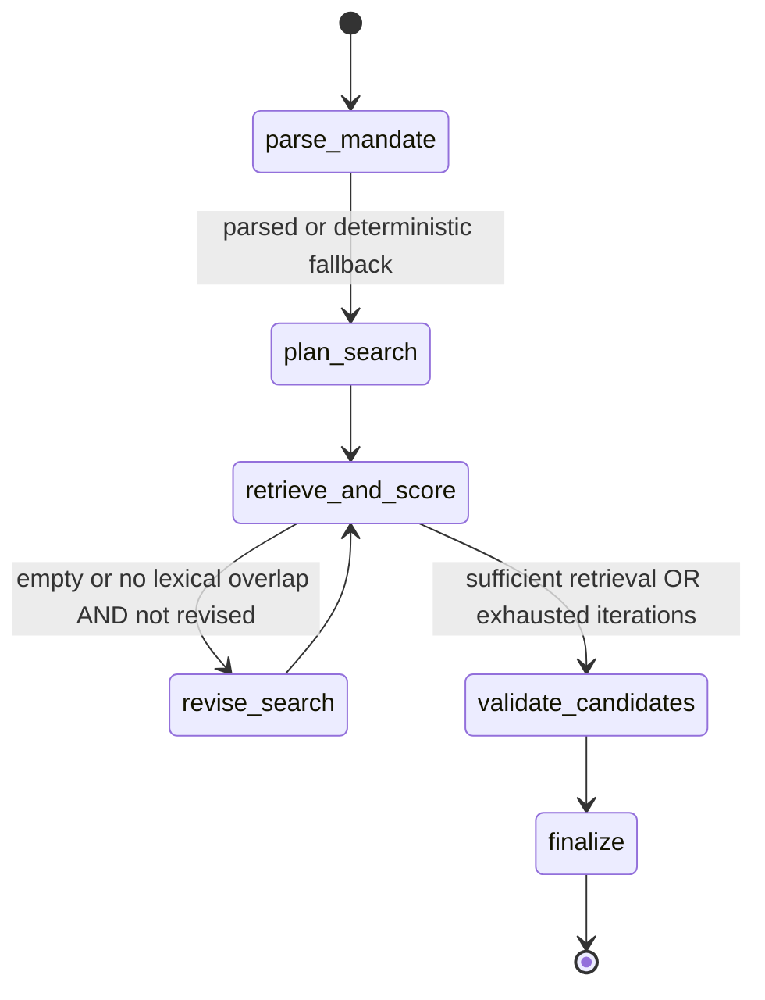

# Comparables.ai — Agentic Search over a 50k Company Catalog

An end-to-end agentic search/reasoning system built against the Comparables.ai
technical assessment brief: natural-language mandate → structured retrieval
(BM25 + structured filters) → evidence-grounded candidate ranking → bounded
failure recovery.

> **Current behavior:** hybrid search ranks the whole SQL-eligible catalog before
> top-100 selection. Semantic acceptance requires evidence for every criterion;
> provider failure never falls back to literal keyword acceptance.
> [Current full-catalog eval](eval/report-current.md) is **1/5** with the model
> unavailable (four minimum-result failures, no unverified companies returned).
> [Labeled eval](eval/relevance-live.md): 8 retrieval contracts pass; real-model
> semantics are **BLOCKED**, not passed. Historical reports are not current results.
> Regression check: **86 passed, 4 live tests skipped; 87% source coverage**.
> Ruff and mypy pass (60 source files).

Russian implementation walkthrough, assessment and interview preparation:
[Guids/README.md](Guids/README.md).

---

## Table of Contents

1. [Architecture overview](#architecture-overview)
2. [Implemented workflow](#implemented-workflow)
3. [Orchestration framework](#orchestration-framework)
4. [Structured state](#structured-state)
5. [Tools](#tools)
6. [Retrieval / filtering strategy](#retrieval--filtering-strategy)
7. [Validation & ranking](#validation--ranking)
8. [Evidence grounding](#evidence-grounding)
9. [Search revision & failure recovery](#search-revision--failure-recovery)
10. [LLM / model choices](#llm--model-choices)
11. [Logging & observability](#logging--observability)
12. [Latency & cost observations](#latency--cost-observations)
13. [Evaluation](#evaluation)
14. [Known limitations](#known-limitations)
15. [Intentionally excluded](#intentionally-excluded)
16. [Quickstart](#quickstart)
17. [Future evolution](#future-evolution)

---

## Architecture overview

The project follows FastAPI **layered best practices**: thin HTTP layer, business
logic in services, data access behind repositories, agent in its own subgraph.

```
┌─────────────────────────── FastAPI app (uvicorn) ───────────────────────────┐
│                                                                              │
│  api/v1/         thin HTTP: routers, deps (Depends), response_model          │
│   │                                                                       │
│   ▼                                                                       │
│  services/        WorkflowService.invoke(query) -> SearchResponse            │
│   │                                                                       │
│   ▼                                                                       │
│  agent/           LangGraph StateGraph                                       │
│   │  parse_mandate ─► plan_search ─► retrieve_and_score                    │
│   │                                          │                              │
│   │                              ┌───────────┤ (revise? only if poor)     │
│   │                              ▼           └──► revise_search ──►        │
│   │                       validate_candidates ─► finalize                   │
│   ▼                                                                       │
│  tools/           filtered_search, bm25_search, filter_search, get_company │
│  repositories/    CompanyRepository (aiosqlite) · BM25Repository (rank_bm25) │
│  llm/             AsyncOpenAI client → Ollama (OpenAI-compat)              │
└──────────────────────────────────────────────────────────────────────────────┘
```

### Production-grade patterns in use

| Pattern | Where | Why |
|---|---|---|
| App factory `create_app()` | `src/comparables/main.py` | Multiple test instances and clean lifespans; a compatibility `app` remains for ASGI imports |
| Lifespan context manager | same | Startup: load BM25 pickle, open SQLite pool, warm LLM client. Shutdown: close cleanly. |
| Dependency injection (`Depends`) | `src/comparables/api/deps.py` | `get_settings`, `get_db`, `get_llm`, `get_workflow`, `get_run_repo` — every dep is overridable in tests |
| Versioned API (`/api/v1/`) | `src/comparables/api/v1/router.py` | Future-proofs breaking changes |
| Health/readiness split | `endpoints/health.py` | `/live` is unconditional; `/ready` exposes startup flags, requiring the data stores and treating LLM availability as a soft signal |
| Custom exception handlers | `main.py` + `core/exceptions.py` | Domain exceptions → RFC-7807-style JSON error bodies |
| `RunIdMiddleware` | `main.py` | Per-request `X-Run-Id` header; id propagates via `contextvars` for log correlation |
| Async-first | everywhere | `httpx.AsyncClient`, `aiosqlite`, BM25 search runs in `asyncio.to_thread` (CPU-bound) |
| Response models | every endpoint | OpenAPI consumes the same Pydantic models the service produces |
| `pydantic-settings` | `core/config.py` | Typed `.env`, no stringly-typed config |
| `structlog` (JSON in prod) | `core/logging.py` | Structured logs with `run_id`, `event`, `duration_ms`, ... — pipeable to Loki / Cloud Logging |
| Specification + Strategy | `agent/policies.py` | `EligibilityPolicy` owns hard constraints; `CandidateRanker` owns scoring, keeping LLM nodes orchestration-focused and independently testable |
| Narrow ports + composition | `services/filtered_search.py`, `services/semantic_validation.py` | `EligibilityReader`, `EligibleRanker`, `StructuredCompleter` decouple use cases from concrete adapters; `SemanticAcceptancePolicy` is a pure rule |

---

## Implemented workflow



### Stages (per assessment brief)

| Stage | LLM? | Notes |
|---|---|---|
| `parse_mandate` | yes (1–2 attempts) | NL query → strict `ParsedMandate`. Closed vocab is sanitized and explicit raw-query constraints take precedence; a conservative deterministic parser handles provider failure. |
| `plan_search` | no | Deterministically routes to SQL, BM25, or hybrid filter-then-rank from the validated mandate and logs the complete plan. |
| `retrieve_and_score` | no | SQL provides all eligible IDs internally; corpus BM25 scores are masked to these IDs, then top-100 is selected. Only the bounded pool enters graph state. |
| `revise_search` | yes (1 call, optional) | Broadens keywords only. Structured filters, `semantic_requirements` and `must_haves` remain immutable. |
| `validate_candidates` | conditional | Structured-only mandates are verified deterministically; semantic criteria use one batched LLM call for at most 10 candidates. |
| `finalize` | no | Returns only `relevant=True` candidates with non-empty grounded evidence, capped at 10; no rejected-result fallback. |

---

## Orchestration framework

**LangGraph** (`langgraph>=0.2`) was chosen over alternatives because:

- **Stateful, cyclic**: retrieval can fail and trigger a revise loop. A pure DAG
  framework would either need an outer loop or degenerate into a state machine
  anyway.
- **Conditional edges**: the decision of whether to revise is a function of
  state (`iteration`, `revised_search_done`, `top_score`).
- **Ephemeral per-invocation state** is enough for this assessment. No
  checkpointer is configured; persistent/resumable state is intentionally deferred.
- **Explicit state**: a `TypedDict` contains Pydantic objects validated at
  boundaries. `TypedDict` itself does not enforce runtime validation.
- **Pluggable persistent storage** (drop-in `PostgresCheckpointer` later — see
  [Future evolution](#future-evolution)) without rewriting the graph.

Alternatives considered:

- **Raw async/await state machine**: a reasonable smaller alternative for this
  one-loop workflow; LangGraph was chosen for explicit transitions and extension.
- **Other pipeline frameworks**: possible, but introducing another abstraction
  would not improve this implementation's core workflow.

---

## Structured state

`AgentState` (`src/comparables/agent/state.py`):

```python
class AgentState(TypedDict, total=False):
    run_id: str
    raw_query: str
    mandate: ParsedMandate | None
    original_mandate: ParsedMandate | None   # acceptance criteria, not revised
    plan: SearchPlan | None
    candidates: list[ScoredHit]              # capped at MAX_CANDIDATES_PER_ITER
    iteration: int                           # 0..2
    revised_search_done: bool
    validation: list[ValidatedItem]
    final: list[ValidatedItem]
    parse_ok: bool
    plan_ok: bool
    validation_ok: bool
    parse_error: str | None
    settings_limits: dict[str, int]          # injected at run start
```

All LLM outputs are constrained by Pydantic JSON schemas
(`ParsedMandate`, `BatchVerdicts`). `SearchPlan` is constructed by code. Validation is schema-based
(`LLMClient.complete_json`) and on schema error the node falls back to a
sensible default rather than letting bad data flow downstream.

---

## Tools

Four deterministic tools (no LLM in the tool itself), each registered through
the `@tool` decorator in `src/comparables/tools/`:

| Tool | Purpose | Inputs | Output |
|---|---|---|---|
| `filtered_search` | Rank across the complete SQL eligibility set, then cap | `query`, `filters: FilterSpec`, `top_k` (≤100) | `[{company_id, score}]`, metadata `eligible_count`; no unbounded ID list exposed |
| `bm25_search` | Lexical retrieval/scoring over `name + description` | `query`, `top_k`, optional `candidate_ids` (≤100) | `[{company_id, score}]` |
| `filter_search` | Deterministic SQL filter (industry, location, revenue, employees, year) | FilterSpec, `top_k` | `[{company_id, score=1.0}]` |
| `get_company` | Hydrate one record for evidence grounding | `company_id: int` | `CompanyRecord` |

Each tool is timed and its result emitted as a `tool_call` event in the run log
with `duration_ms`, `ok`, `error?`.

---

## Retrieval / filtering strategy

Two complementary paths with an explicit eligibility boundary:

1. **BM25** (`rank_bm25.BM25Okapi`) over the `name + description` corpus.
   - Pre-tokenized at ingestion; saved to `data/bm25.pkl`.
   - Query-time scoring is wrapped in `asyncio.to_thread` (CPU-bound).
   - With hard filters, `filtered_search` passes the complete SQL eligibility
     mask internally. Only the ranked top-100 crosses the tool boundary.
   - Normalized to `[0, 1]` per result set.
2. **Structured filters** (SQL on SQLite, async via `aiosqlite`):
   - `industry IN (...)`, `location IN (...)`,
     `revenue_range IN (...)`,
     `employee_count >= ? AND <= ?`,
    `founded_year >= ? AND <= ?`.
   - Indexes on every closed-vocab column at ingestion.

The hybrid plan no longer applies SQL LIMIT before lexical ranking. It ranks
all eligible indexed records and uses a bounded heap to select top-100, breaking
ties by ID. The regression fixture places the best eligible record at ID 200
behind 199 distractors and a higher-scoring ineligible record at ID 201.
Structured-only retrieval still uses SQL LIMIT: all eligible records satisfy
the same requested structured criteria. If keyword hints are missing but semantic
requirements exist, their text supplies the lexical query instead of taking this
structured-only shortcut. Full masks and corpus scoring suit 50k, not 350M rows;
a distributed filter-aware index remains a scaling step.

**Score combination** (`SCORE_W_BM25=0.7`, `SCORE_W_FILTERS=0.3`):

```
score = α · bm25_norm + β · filter_match
```

A structured filter is never a soft score. If at least one filter exists,
SQL defines the eligible ID set and every ineligible BM25-only row is discarded.
BM25 then ranks inside that set; a filter-only match receives `0.3`, while a
lexical match can add up to `0.7 × keyword_boost` (final score capped at 1.0).
With no structured filters, BM25 is the candidate source by itself.

Why BM25 and not dense embeddings:

- Descriptions are short and templated, so BM25 is a simple initial baseline.
  The benefit of dense retrieval has not yet been measured on a labeled set.
- BM25 is deterministic and explainable (you can show the matched terms).
- BM25 builds run once at ingestion; timings depend on the machine and corpus.

---

## Validation & ranking

Every hydrated record is checked again by `EligibilityPolicy` before
validation. Structured-only mandates are accepted deterministically and get
field-level evidence for the exact industry/location/range/year values. If the
mandate contains `semantic_requirements`, `must_haves`, or legacy keywords, at most ten eligible records are
validated in one batch (up to two provider attempts on malformed output):

```python
class CandidateVerdict(BaseModel):
    company_id: int
    criteria: list[CriterionVerdict]

class CriterionVerdict(BaseModel):
    criterion_id: str
    status: Literal["supported", "contradicted", "insufficient_evidence"]
    evidence: list[SemanticEvidence]  # named field + exact quote
```

Re-ranking is deterministic (`score` descending, then company ID). A candidate
is returned only when every original atomic requirement has status `supported`
and traceable evidence. Missing, duplicate or invented company/criterion IDs
invalidate the batch. Contradiction, missing evidence, schema/provider failure
or budget exhaustion reject the affected candidate; no literal fallback remains.
AND claims are separate requirements; OR alternatives and negations stay within
the corresponding requirement. The prompt requests complete clauses including
qualifiers. A model can still misinterpret a real quote: the labeled evaluation
measures that error rather than pretending substring checks prove entailment.

---

## Evidence grounding

Every evidence item names a real `CompanyRecord` field and contains a verbatim
substring of that field. Semantic LLM spans are restricted to `name` or
`description`; structured evidence points to `industry`, `location`,
`employee_count`, `revenue_range`, or `founded_year`. This is enforced twice:

1. **Schema prompt** (`VALIDATE_CANDIDATE_SYSTEM`): decide each complete claim;
   use `insufficient_evidence` when the record does not establish it.
2. **Code-side policy** (`SemanticAcceptancePolicy`): each semantic span
   must occur in the specific name or description field. Structured spans are
   generated from the hydrated record itself. An untraceable quote makes that
   criterion insufficient; any unsupported criterion prevents acceptance.

This guarantees that:

- A user can highlight exactly which phrase of a record justified inclusion.
- Invented quotations are rejected. A real quotation does not by itself prove
  that every semantic requirement is satisfied; that requires relevance evaluation.

---

## Search revision & failure recovery

After the first retrieval, the graph invokes `revise_search` only when the pool
is empty or semantic keywords have no lexical overlap, and only if no revision
has already run:

- LLM receives the original mandate, the top-5 current results, and the
  iteration number.
- LLM proposes synonym/related-term additions to `keywords`.
- Code copies only the revised keywords. All original structured filters and
  `must_haves` remain unchanged even if the model proposes relaxing them.
- An immutable copy of the original mandate is used for final acceptance and
  returned to the caller; revised keywords are retrieval hints only.
- We re-enter `retrieve_and_score` once. Bounded to **at most 1 revised search
  per run** by `MAX_REVISED_SEARCHES=1`.

`RunContext` reserves the global LLM budget before every provider attempt, so
retries cannot push a run above five calls. On parser/provider failure the
workflow uses a conservative deterministic parse/plan fallback. Because regex
parsing cannot prove complete interpretation, the original query is retained as
an unverified requirement. If the validator is also unavailable, even apparently
structured-only fallback queries return no candidates. After successful parsing,
truly structured-only mandates still need no final LLM. This trades degraded-mode
availability for avoiding silent acceptance of unverified conditions.
Timeouts and exceptions still persist all buffered events plus a terminal
`run_end` outcome.

---

## LLM / model choices

| Provider | Ollama (open-source, local) |
|---|---|
| API | OpenAI-compatible (`/v1/chat/completions`) via `openai.AsyncOpenAI` |
| Default model | `ministral-3:3b` (about 3 GB download in the local setup) |
| Other models | Configurable via `LLM__MODEL`; no automatic model fallback is implemented |
| Structured output | Pydantic schemas with `extra="forbid"`; parser and validator get up to two attempts each, revision one, all under a shared five-call budget |

Why local inference: no per-request provider charge and records stay on the
configured local endpoint. Hardware, electricity and operation are not free.
Latency and reproducibility depend on model/runtime/hardware; malformed JSON
was observed and is handled explicitly.

Prompt design notes: each prompt cites **allowed values** explicitly
(`PARSE_MANDATE_SYSTEM`) and provides `schema_instructions(Pydantic model)` so
the LLM knows which keys exist and which types are accepted. Even so, smaller
models sometimes hallucinate; the **sanitizer** in
`src/comparables/agent/sanitize.py` strips any `industries`/`locations`/
`revenue_buckets` value not in the dataset's allowed set, with a synonym map
for common paraphrases.

---

## Logging & observability

Every invocation gets a unique 12-character run ID (or inherits an upstream
`X-Run-Id` for an HTTP trace). `RunRepository` writes an append-only
`runs/<run_id>.jsonl` containing the parsed mandate, search plan, every LLM
attempt, each tool call with success/failure and duration, per-iteration
candidate counts, revision, validation outcome, and finalize stage.

The terminal `run_end` event is written on success, timeout, and exception. It
contains executed stages, retrieved/validated/returned counts, revision count,
LLM/tool calls, input/output tokens, end-to-end latency, errors, and estimated
cost. Ollama runs report `$0.0`; unknown managed-provider pricing reports
`null` rather than a fabricated estimate. `GET /api/v1/runs/{run_id}` restores
these exact aggregate values from `run_end`.

---

## Latency & cost observations

From the saved live-model eval on 2026-09-02 (`eval/report.md`), before the latest
additional evaluator checks. These are historical measurements, not a new live run:

| Query | Latency (s) | LLM calls | Iters | Results |
|------|------------:|----------:|------:|--------:|
| q1: AI fintech Nordics >100 emp | 35.177 | 2 | 1 | 8 |
| q2: Renewable energy DE founded>2018 | 35.253 | 2 | 1 | 10 |
| q3: Healthcare $50M-$100M USA | 10.681 | 2 | 1 | 10 |
| q4: Autonomous driving NL | 34.861 | 2 | 1 | 9 |
| q5: Biotech France >5000 emp (edge) | 7.944 | 1 | 1 | 0 |

- P50 ≈ 34.9 s for this five-query sample, dominated by inference.
- LLM calls per run: normally **1** for structured-only search and **2** when
  semantic validation is needed; schema retry/revision remains bounded by 5.
- "Approximate cost" = **$0 provider API charge** at self-hosted inference;
  infrastructure cost is excluded.
- Token usage is recorded per call via `RunContext` (`tokens_in/out`,
  `llm_calls`) and exposed in the `RunLog` (`runs/<id>.jsonl`).

---

## Evaluation

Five deterministic queries live in `eval/queries.json`. Each has an `expected`
block describing the structure of the answer:

| Field | Meaning |
|---|---|
| `industries` | allowed industry values for the returned candidates |
| `locations` | allowed location values |
| `revenue_buckets` | expected `revenue_range` values |
| `employee_min` / `employee_max` | inclusive normalized thresholds (`more than 100` becomes `employee_min=101`) |
| `founded_after` / `founded_before` | inclusive normalized years (`after 2018` becomes `founded_after=2019`) |
| `keywords_any` | for keyword-only queries: at least one of these must appear in the LLM's `keywords` |
| `min_results` | require at least N returned candidates |
| `allow_empty` | `min_results` check is skipped |

Per-query structural checks (always required):

- `parsed_criteria` — every expected field is present with the correct normalized value.
- `mandatory_filters` — **every** returned row satisfies **every** parsed hard filter.
- `dataset_existence` — IDs are fetched from SQLite and compared exactly; no numeric-range shortcut.
- `record_fidelity` — every returned field matches the source record, not only its ID.
- `unique_results` — duplicate company IDs are rejected.
- `evidence_traceability` — every returned row is relevant, has evidence, and every span occurs in its named field.
- `semantic_validation_contract` — every original criterion is present, supported and separately grounded; not a proof of semantic truth.
- candidate, validation, result, LLM, iteration, and revision hard bounds;
  every recorded retrieval pool is checked for unique IDs and size.
- `run_observability` — persisted `run_end` counts agree with the API response.
- unique run IDs across all five direct service invocations.

Run:

```powershell
docker compose exec app python -m scripts.run_eval --report /app/runs/eval-report.md
docker compose cp app:/app/runs/eval-report.md .\eval-report.md
```

Exit code 0 = all pass, 1 = at least one fail.

### Labeled relevance suite

`eval/relevance.json` contains 15 synthetic company records, 24 labeled semantic
cases (negation, conjunction, paraphrase, missing evidence, aspirations and prompt
injection), and 8 retrieval cases with exhaustive relevant IDs for this small
corpus. Labels are **assistant-curated, not independently human reviewed**.

```powershell
docker compose exec app python -m scripts.eval_relevance --report /app/runs/relevance-report.md
docker compose exec app python -m scripts.eval_relevance --live --report /app/runs/relevance-live.md
docker compose cp app:/app/runs/relevance-live.md .\relevance-live.md
```

Offline mode measures actual SQL/BM25 P@5, recall@100 and NDCG@5. Live mode uses
the real configured validator, never a fake predictor; reports criterion accuracy,
acceptance precision/recall, false accepts, confusion matrices, failures, latency
and tokens. Gold statuses/spans are not sent to the model. JSON reports include
dataset/prompt hashes and label provenance. An unavailable model yields **BLOCKED**
and exit 2; regression failures yield 1. No semantic metrics are fabricated.

Dev/holdout is only a maintenance split with a shared tiny corpus. Recall@100 on
15 records is not a production-quality claim, and isolated validation does not
measure parser completeness. Independent reviewers and unseen real-catalog queries
remain necessary. Walkthrough: [Guids/07](Guids/07-Retrieval-and-Semantic-Evaluation.md).

---

## Known limitations

1. **No semantic embeddings**: lexical search caps the ceiling for paraphrased
   queries (e.g. "self-driving car" vs. "autonomous vehicle"). Mitigated by the
   synonym map in the sanitizer and the validator's relevance judgment.
2. **English-only**: no language detection or non-English tokenization.
3. **No streaming**: the entire `SearchResponse` is returned when validation
   finishes. For long-horizon agents we'd add SSE.
4. **No workflow checkpointer**: graph state exists only for the current
   invocation. JSONL run events are durable audit records, not resumable state.
5. **No independent human relevance benchmark or current live-model result**:
   the new labeled fixture supports regressions, not business-level quality claims.
6. **In-memory full-corpus scoring**: early SQL top-K is fixed, but lexical recall,
   final top-10 validation and index/catalog consistency still limit completeness.
7. **Closed taxonomy and limited fallback parser**: unknown values can be
   dropped during normalization; unsupported criteria need explicit handling.
   "Startup" and the Automotive mapping are dataset/business assumptions.
8. **No dependency lockfile or load-tested SLA**: version ranges are broad;
   type checking skips third-party stubs. Model concurrency is not controlled.

---

## Intentionally excluded

- Vector / ANN search (short descriptions, not worth the index size and the
  extra moving part).
- Persistent checkpointer (the assessment uses ephemeral graph state plus JSONL audit logs).
- Auth / rate-limiting in the API.
- Frontend / UI.
- Streaming responses.
- Multi-agent / hierarchical agents.
- Real dataset ingestion at 350M scale (covered in the brief but not
  implementable in 12–16h without distributed infra).

---

## Quickstart

### 1. Docker — full stack (supported route)

The only runtime prerequisite is Docker Desktop / Docker Engine with the
Compose plugin. The checked-out `companies.json` must remain in the repository
root; Python, `pip`, a local Ollama installation and a `.env` file are **not**
required. Compose runs four ordered components: Ollama, a one-shot model pull,
the one-shot catalog/BM25 ingestion job, then the API.

```powershell
# Run from the repository root. First start downloads the default 3 GB model.
docker compose config --quiet
docker compose up --build --wait -d
docker compose ps

# The API is ready only after SQLite and BM25 are usable.
Invoke-RestMethod http://localhost:8000/api/v1/health/ready
```

Ollama is intentionally internal to the Compose network, so an already running
local Ollama does not conflict. Only API port `8000` is published. Change the
model for a fresh/changed deployment by setting `LLM__MODEL` in the shell or
an untracked `.env`, then re-run `docker compose up --build --wait -d`.

OpenAPI is available at `http://localhost:8000/docs`.

Health endpoints:

- `GET /api/v1/health/live` — process is alive.
- `GET /api/v1/health/ready` — SQLite and BM25 are required; `llm_ready` is
  reported as a soft signal because semantic validation fails closed when the
  provider is unavailable.

### 2. Manual API and reports

```powershell
$body = @{ query = 'Find AI-driven fintech companies in the Nordics with more than 100 employees' } | ConvertTo-Json
$result = Invoke-RestMethod -Method Post -Uri http://localhost:8000/api/v1/search -ContentType application/json -Body $body
$result | ConvertTo-Json -Depth 12
Invoke-RestMethod http://localhost:8000/api/v1/runs/$($result.run_id) | ConvertTo-Json -Depth 12

# Assessment and relevance reports persist in the run_data named volume.
docker compose exec app python -m scripts.run_eval --report /app/runs/eval-report.md
docker compose exec app python -m scripts.eval_relevance --report /app/runs/relevance-report.md
docker compose exec app python -m scripts.eval_relevance --live --report /app/runs/relevance-live.md
docker compose cp app:/app/runs/eval-report.md .\eval-report.md
```

`--live` intentionally returns exit code 2 and writes `BLOCKED` if the chosen
model cannot be reached; it never fabricates semantic results. The Compose
init job makes ingestion part of every fresh `up`; it replaces the configured
catalog. To rebuild an already-running catalog deliberately, run
`docker compose stop app`, then `docker compose run --rm --no-deps ingest`,
then `docker compose start app`. Restarting the stopped API makes it load the
new SQLite/BM25 pair without needlessly executing the init job twice.

The `catalog_data`, `run_data` and `ollama_data` named volumes survive
`docker compose down`. `docker compose down -v` is an explicit destructive
reset: it deletes those three volumes and forces the model to download again.

### 3. Tests

```powershell
# Fast deterministic suite; no local Python or provider is used.
docker compose --profile test run --build --rm --no-deps test python -m pytest -q -p no:cacheprovider
docker compose --profile test run --build --rm --no-deps test python -m ruff check src scripts tests
docker compose --profile test run --build --rm --no-deps test python -m mypy src

# Full Compose test job: starts internal Ollama, pulls the model and executes
# the four live-provider tests in addition to unit/integration tests.
docker compose --profile test up --build --abort-on-container-exit --exit-code-from test test
```

Tests build an isolated temporary catalog
through the real ingestion path; no pre-existing `data/` is required.

The historical degraded 5/5 report predates removal of literal acceptance.
The current unavailable-model run is 1/5: q1–q4 fail minimum results because
unverified candidates are withheld; q5's expected empty result passes.
See [Guids/04](Guids/04-Testing-and-Operations.md)
for commands, troubleshooting and the limits of each check.

---

## Future evolution

The following are deliberately **not** implemented now but are the natural
next steps to take this from assessment-grade to production-grade:

1. **350M+ companies → Tantivy or Elasticsearch.** BM25 stops scaling when the
   corpus is hundreds of millions. Swap `BM25Repository` with a Tantivy/
   Elasticsearch adapter behind the same `Tool` interface. Add a sharded vector
   store (Qdrant, Milvus) for semantic recall and reciprocal-rank-fuse with
   BM25.

2. **Concurrent runs / horizontal scale.** Add
   `langgraph.checkpoint.Postgres` or Redis, multiple ASGI workers, and a queue
   (Celery / Arq / Cloud Tasks) for fire-and-forget runs. Move JSONL events to
   an append-only centralized event store.

3. **Multi-provider LLM.** `LLMClient` is the only place that knows about
   Ollama. Add an Anthropic / OpenAI / Bedrock adapter that fulfills the same
   `complete_json(system, user, schema_model, ctx)` contract. Allow per-env
   config so a managed provider can backstop self-hosted latency.

4. **Production observability.** structlog → OpenTelemetry → Prometheus +
   Grafana (or vendor equivalent). Trace graphs in LangSmith / Langfuse;
   per-stage latency, token usage, validator rejection rate, `revise`
   activation rate.

5. **Model / prompt versioning.** Add prompt hashes and model fingerprints to
   each run, backed by a registry (git for prompts, MLflow for models), with
   A/B routing via a feature flag.

6. **Persistent workflow state.** Add `langgraph.checkpoint.Postgres` for
   resumable long-running runs. Expose `POST /api/v1/runs/{run_id}/resume` to
   pick up where it left off.

7. **Data lineage + governance.** Each `RunLog` should embed the dataset
   version (git SHA of `companies.json`), the prompt hash, the model version,
   and an immutable per-record version so an auditor can reconstruct the inputs
   and evidence. Exact model-output replay may additionally require stored outputs.

8. **MCP-compatible tools.** The current `ToolRegistry` is already a clean
   protocol (`name`, `description`, `input_schema`, `run`). Wrap it as an
   MCP-server and turn the agent into an MCP-client so other agents
   (Comparables' future, third-party IDE assistants) can plug in.

---

## Project layout

```
.
├── PLAN.md                          # frozen implementation plan
├── pyproject.toml
├── Dockerfile
├── docker-compose.yml
├── companies.json                   # input (50k companies)
├── .env / .env.example
├── data/                            # gitignored
│   ├── companies.sqlite
│   └── bm25.pkl
├── runs/                            # gitignored
├── eval/
│   ├── queries.json
│   └── report.md
├── scripts/
│   ├── ingest.py
│   └── run_eval.py
├── src/comparables/
│   ├── main.py                      # create_app() factory + lifespan + middleware
│   ├── core/                        # config, logging, exceptions, context
│   ├── api/v1/endpoints/            # search, runs, health
│   ├── schemas/                     # Pydantic DTOs
│   ├── services/                    # WorkflowService facade
│   ├── repositories/                # CompanyRepository, BM25Repository, RunRepository
│   ├── tools/                       # @tool-decorated deterministic tools
│   ├── agent/                       # LangGraph (state, prompts, nodes, edges, graph, sanitize)
│   └── llm/                         # LLMClient + structured output
├── tests/                           # pytest, asyncio_mode=auto
└── .claude/skills/                  # project-scoped dev skills
```

---

## License

Internal — proprietary, Comparables.ai assessment submission.
